# Consumer-Complaints-DB

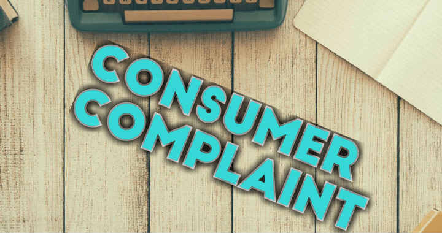

## Introduction

I will be analysing consumer_complaint data from Government Agency as a Data Analyst. I have been granted access to a database file called “ComplaintsDB.sql” with consumer complaints received by financial institutions in 2013 – 2015.

## Data Source
Using Consumer_complaint data from Consumer Financial Protection Bureau (CFPB)

## Problems 
Complaints Questions
1. Find out how many complaints were received and sent by CFPB on the same day. 
2. Get the top 3 products that had complaints received and sent on the same day.
3. Get the top 5 issues received and sent by CFPB on the same day.
4. Get the top 5 companies targeted that the complaints were received and sent by CFPB on the same day.
5. Get the top 3 companies with the invest number of complaints.
6. List the two dates CFPB had the most issues received.
7. List the two dates CFPB had the lowest number of issues received.
8. Which mode of communication had the most complaints submitted with?
9. List two states with the most complaints received by CFPB.
10. Which state had the most complaints received as regards "students’ loan" in the product name field?
11. List two companies having the most consumer disputed as "yes".

## Solution

1. Find out how many complaints were received and sent by CFPB on the same day.

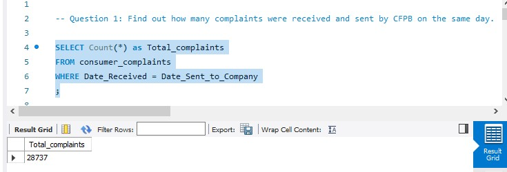

2. Get the top 3 products that had complaints received and sent on the same day.

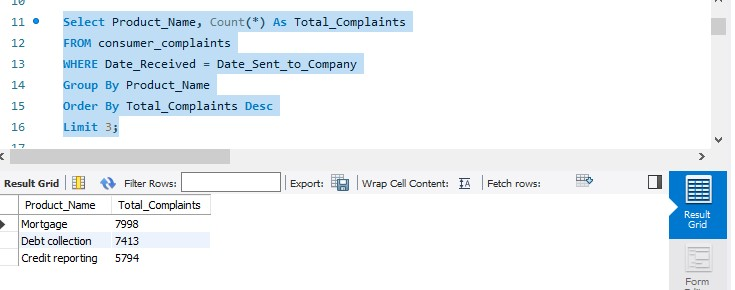

3. Get the top 5 issues received and sent by CFPB on the same day.

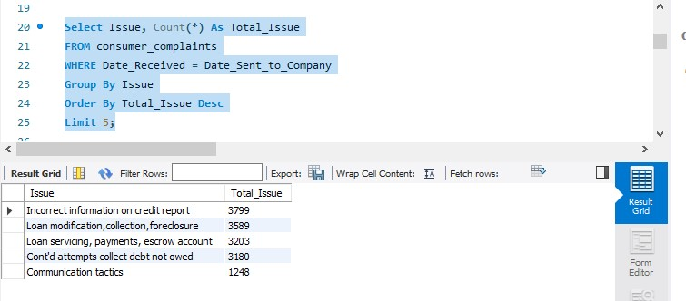

4. Get the top 5 companies targeted that the complaints were received and sent by CFPB on the same day.

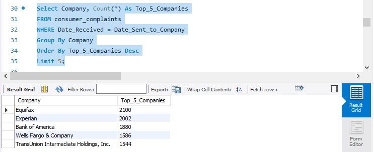

5. Get the top 3 companies with the invest number of complaints.

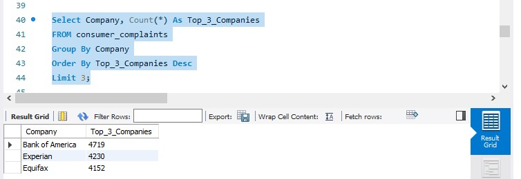

6. List the two dates CFPB had the most issues received.

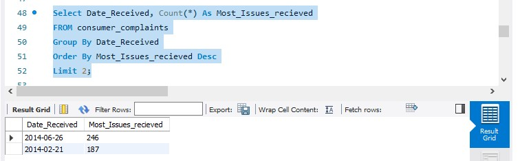

7. List the two dates CFPB had the lowest number of issues received.

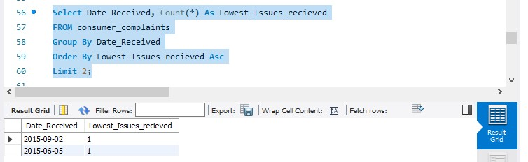

8. Which mode of communication had the most complaints submitted with?

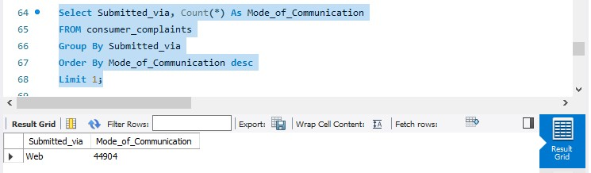

9. List two states with the most complaints received by CFPB.

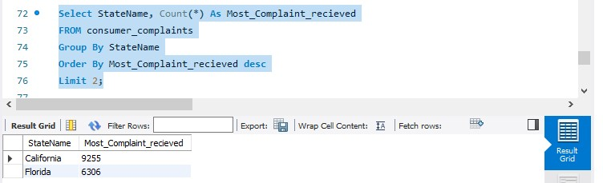

10. Which state had the most complaints received as regards "students’ loan" in the product name field?

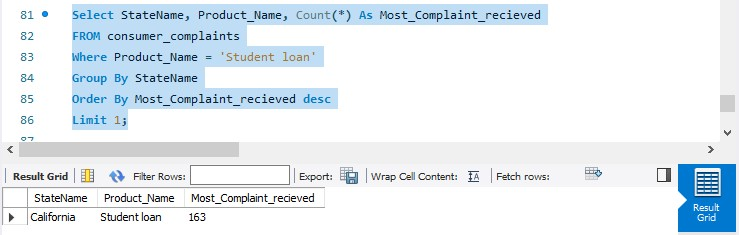

11. List two companies having the most consumer disputed as "yes".

## Summary of Findings

From the analysis carried out, here are some of the valuable insights from the dataset provided by the CFPB (Consumer Financial Protection Bureau). Let's explore the findings discovered along this journey.

1.	The first revelation came in the form of the number of complaints received and sent by the CFPB on the same day, amounting to a total of 28,737. This statistic highlights the CFPB's active involvement in addressing consumer grievances promptly and efficiently.

2.	Next, the data analyst delved into the realm of products that garnered the most complaints received and sent on the same day. The top three products identified were Mortgage, Debt Collection, and Credit Reporting. These findings shed light on the areas where consumers encountered the most issues, emphasizing the need for regulatory attention and consumer protection measures in these sectors.

3.	Moving on to the issues themselves, the analyst uncovered the top five issues received and sent by the CFPB on the same day. These issues included Incorrect information on credit reports, Loan modification, collection, and foreclosure, Loan servicing, payments, and escrow account, Continued attempts to collect debt not owed, and Communication tactics. These issues reflect common pain points experienced by consumers, highlighting the areas where regulatory intervention and consumer education could make a significant impact.

4.	Shifting focus to the companies targeted by complaints, the data analyst revealed the top five companies that received and sent the most complaints on the same day. These companies were Equifax, Experian, Bank of America, Wells Fargo & Company, and TransUnion Intermediate Holdings, Inc. These findings shed light on the companies that faced the highest number of consumer grievances, signaling potential areas for improvement in their customer service and practices.

5.	Further exploration led the analyst to identify the top three companies with the highest number of overall complaints. Bank of America, Experian, and Equifax emerged as the frontrunners in terms of the invest number of complaints. This finding highlights the significant impact these companies have on consumers' financial experiences and underscores the need for effective customer support and resolution processes.

6.	Delving deeper into the dataset, the analyst uncovered the two dates on which the CFPB received the highest number of issues. On June 26, 2014, a staggering 246 issues were received, while February 21, 2014, saw 187 issues. These dates signify critical periods during which consumers faced substantial challenges, necessitating swift action and regulatory intervention.

7.	Conversely, the analyst also discovered the two dates with the lowest number of issues received by the CFPB. On September 2, 2015, and June 5, 2015, only one issue each was reported. These dates highlight relatively quieter periods, indicating either an improvement in consumer experiences or a temporary lull in complaint submissions.

8.	Examining the mode of communication through which complaints were submitted, the analyst found that the web platform emerged as the preferred choice, with 44,904 complaints submitted through this channel. This emphasizes the importance of user-friendly online interfaces and digital platforms for consumers to voice their concerns conveniently.

9.	Shifting focus to geographical patterns, the analyst identified the two states that received the highest number of complaints by the CFPB. California topped the list with 9,255 complaints, closely followed by Florida with 6,306 complaints. These statistics highlight the need for targeted consumer protection efforts in these states, ensuring that residents receive fair treatment and adequate financial services.

10.	Narrowing down to a specific product, the analyst determined that California had the most complaints received regarding "student loans" in the product name field, with a total of 163 complaints. This finding sheds light on the challenges faced by students and borrowers in the state's educational and financial landscape, calling for measures to alleviate the burdens

11.	Finally, the analysis explored the companies with the most consumer disputes marked as "yes." Bank of America took the lead with 1,069 consumer disputes, followed closely by Equifax with 962 disputes. These findings suggest areas where consumers experienced dissatisfaction with the services provided by these companies, highlighting the importance of effective dispute resolution mechanisms.

## Conlusion

In conclusion,  from the analysis journey through the CFPB dataset, I uncovered a wealth of insights. The data revealed the scale of complaints received and sent by the CFPB on the same day, shedding light on the bureau's proactive approach to addressing consumer grievances. The identification of the top products, issues, and companies targeted by complaints provided a comprehensive understanding of the challenges faced by consumers in the financial realm. 

Additionally, the analysis highlighted the significance of web communication, geographical patterns, and specific product-related concerns. Armed with these insights, stakeholders can devise targeted strategies to improve customer experiences, enhance regulatory measures, and promote fair practices in the financial industry.

## Limitation

The database of consumer complaints from CFPB used was from 2013 – 2015.
