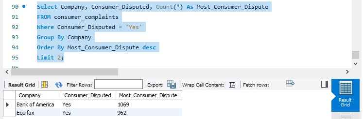

# Consumer-Complaints-DB

## Introduction

I will be analysing consumer_complaint data from Government Agency as a Data Analyst. I have been granted access to a database file called “ComplaintsDB.sql” with consumer complaints received by financial institutions in 2013 – 2015.

## Data Source
Using Consumer_complaint data from Consumer Financial Protection Bureau (CFPB)

## Problems 
Complaints Questions
1. Find out how many complaints were received and sent by CFPB on the same day. 
2. Get the top 3 products that had complaints received and sent on the same day.
3. Get the top 5 issues received and sent by CFPB on the same day.
4. Get the top 5 companies targeted that the complaints were received and sent by CFPB on the same day.
5. Get the top 3 companies with the invest number of complaints.
6. List the two dates CFPB had the most issues received.
7. List the two dates CFPB had the lowest number of issues received.
8. Which mode of communication had the most complaints submitted with?
9. List two states with the most complaints received by CFPB.
10. Which state had the most complaints received as regards "students’ loan" in the product name field?
11. List two companies having the most consumer disputed as "yes".

## Solution

1. Find out how many complaints were received and sent by CFPB on the same day.

2. Get the top 3 products that had complaints received and sent on the same day.

3. Get the top 5 issues received and sent by CFPB on the same day.

4. Get the top 5 companies targeted that the complaints were received and sent by CFPB on the same day.

5. Get the top 3 companies with the invest number of complaints.

6. List the two dates CFPB had the most issues received.

7. List the two dates CFPB had the lowest number of issues received.

8. Which mode of communication had the most complaints submitted with?

9. List two states with the most complaints received by CFPB.

10. Which state had the most complaints received as regards "students’ loan" in the product name field?

11. List two companies having the most consumer disputed as "yes".

